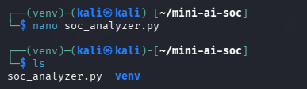
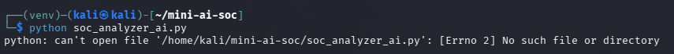
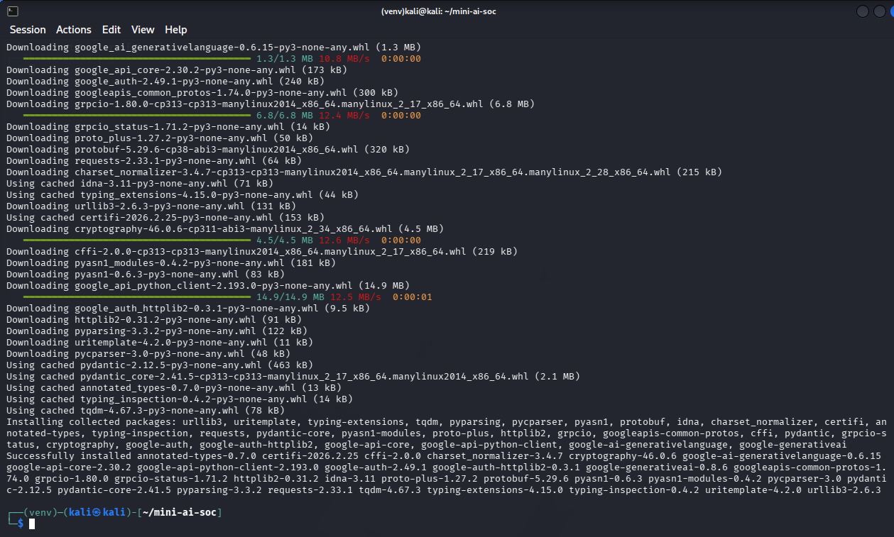

# 🛡️ AI-Assisted SOC Alert Analyzer

## 📌 Overview

This project simulates a **realistic SOC (Security Operations Center) workflow** where alerts are ingested, triaged, enriched, and analyzed using both **rule-based logic** and **AI-assisted reasoning**.

Instead of relying solely on automation or AI, this project demonstrates how the two can work together to produce **structured, actionable security insights**.

The goal was to build something that reflects how a modern SOC analyst actually works:
- Investigate alerts
- Add context
- Validate severity
- Recommend response actions

---

## 🎯 Objectives

- Simulate real-world SOC alert triage
- Combine **deterministic detection logic** with **AI-assisted analysis**
- Map activity to **MITRE ATT&CK techniques**
- Demonstrate progression toward **agentic AI workflows**
- Build a modular, reusable Python-based analysis tool

---

## ⚙️ Features

### 🔍 Alert Processing
- Reads alerts from a JSON file
- Supports multiple event types:
  - Brute force attempts
  - Port scans
  - Authentication anomalies

### 🧠 Rule-Based Triage
- Severity scoring (High / Medium / Low)
- Confidence scoring
- MITRE ATT&CK mapping

### 📊 Investigation Context
- Timeline reconstruction
- Alert ID tracking
- Source IP correlation

### 🤖 AI-Assisted Analysis
- Uses Gemini to:
  - Summarize incidents
  - Validate severity
  - Suggest MITRE mappings
  - Recommend response actions

### ⚡ Decision + Response Layer
- Generates recommended actions based on severity
- Simulates response actions:
  - Monitoring
  - Isolation
  - Investigation steps

### 📈 Batch Summary
- Total alerts processed
- Severity distribution
- MITRE ATT&CK coverage
- Source IP breakdown

---

## 🧱 Architecture

```text
alerts.json
↓
Rule-Based Triage (Severity + MITRE + Confidence)
↓
Decision Layer (Recommended Actions)
↓
Simulated Response
↓
Timeline Reconstruction
↓
AI Analysis (Context + Recommendations)
↓
Batch Summary
```

---

## 📸 Project Walkthrough

### 🔴 1. Reconnaissance (Attack Simulation)


Simulated reconnaissance using Nmap across 1000 TCP ports.  
The scan identified an exposed DNS service (port 53), demonstrating how attackers discover available services and potential entry points.

---

### ⚙️ 2. Rule-Based SOC Triage


Initial triage using deterministic logic:
- Severity classification
- MITRE ATT&CK mapping
- Confidence scoring

---

### 🤖 3. AI-Assisted Analysis



AI-generated analysis expands on the alert by:
- Providing a structured summary
- Validating or adjusting severity
- Suggesting additional MITRE techniques
- Recommending response actions

---

### 🧪 4. Development & Troubleshooting



During development, multiple real-world issues were encountered:
- API key configuration errors
- Dependency conflicts in Kali Linux
- Model compatibility issues

---

### 🛠️ 5. Development Workflow (Optional)



Example of editing and executing the analyzer within the lab environment.

---

## 📁 Project Structure

```text
mini-ai-soc/
├── soc_analyzer.py
├── alerts.json
├── screenshots/
│   ├── nmap_scan.png
│   ├── soc_analyzer_output.png
│   ├── ai_analysis_output.png
│   ├── debugging_example.png
│   └── development_workflow.png
└── README.md
```

---

## 🚀 How to Run

### 1. Clone the repository

```bash
git clone https://github.com/YOUR_USERNAME/mini-ai-soc.git
cd mini-ai-soc
```

### 2. Create a virtual environment

```bash
python3 -m venv venv
source venv/bin/activate
```

### 3. Install dependencies

```bash
pip install google-genai
```

### 4. Set API key

```bash
export GEMINI_API_KEY="your_api_key_here"
```

### 5. Run the analyzer

```bash
python soc_analyzer.py alerts.json
```

---

## 🧪 Example Alerts

```json
[
  {
    "id": "ALERT-001",
    "event": "Failed login attempts",
    "source_ip": "192.168.1.45",
    "target_user": "admin",
    "attempts": 15,
    "time_window": "2 minutes"
  }
]
```

---

## 📊 Example Output

```text
=== PRE-AI ANALYSIS ===
Calculated Severity: Medium
MITRE Mapping: T1110 - Brute Force
Confidence: Moderate Confidence

[AI Analysis]
- Summary
- Severity validation
- Recommended actions
```

---

## 🧾 Sample Logic (Severity Scoring)

```python
def calculate_severity(alert):
    if alert["attempts"] > 20:
        return "High"
    elif alert["attempts"] >= 10:
        return "Medium"
    return "Low"
```

---

## 🔧 Troubleshooting

### ❌ "externally-managed-environment" error (Kali)
```bash
python3 -m venv venv
source venv/bin/activate
```

---

### ❌ API Key Not Found
```bash
export GEMINI_API_KEY="your_api_key_here"
```

---

### ❌ Model Not Found / 404 Errors
- Verify model name (e.g., `gemini-1.5-flash`)
- Confirm API access is enabled

---

### ❌ Script Not Found
```bash
cd ~/mini-ai-soc
ls
```

---

## 🔐 Security Perspective

This project highlights how modern SOC teams can:

- Reduce alert fatigue through automation  
- Improve investigation speed with AI assistance  
- Correlate events across multiple signals  
- Move toward semi-autonomous response workflows  

---

## 🚧 Future Improvements

- Integrate with SIEM tools (Splunk, ELK)
- Pull live MITRE ATT&CK data via STIX
- Add real-time log ingestion
- Implement automated SOAR playbooks
- Build a web dashboard for alert visualization

---

## 💡 Lessons Learned

- AI works best when paired with structured logic  
- Context (timeline, source, behavior) is critical in investigations  
- Debugging environment issues is part of real-world security work  
- Even a single open port can provide meaningful attack surface insight  

---

## 👤 Author

Shannon Smith  
Cybersecurity | Threat Detection | Incident Response | Automation & AI
