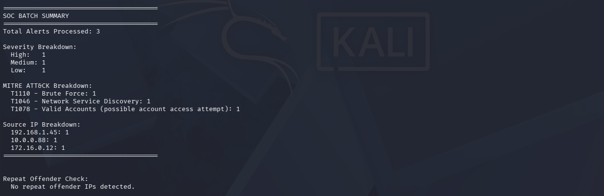
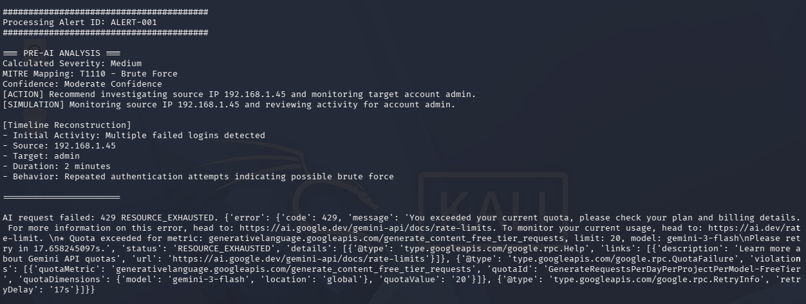
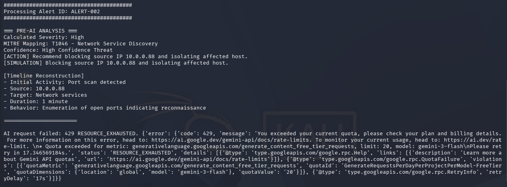
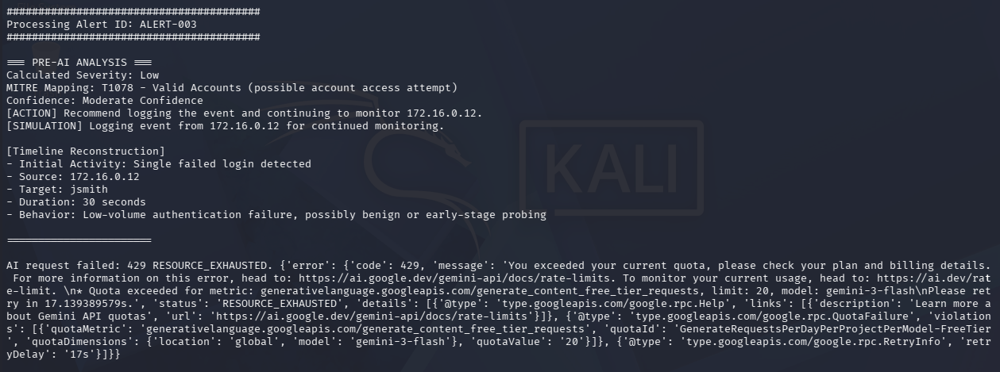
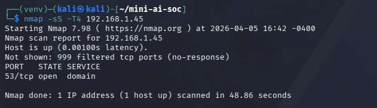
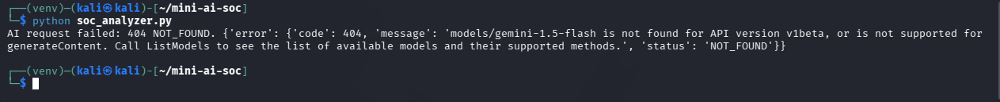

<div align="center">

## 🛡️ AI-Assisted SOC Alert Analyzer  
### SOC Triage • MITRE ATT&CK Mapping • Alert Investigation


</div>

<div align="center">
  
</div>

<p align="center"><em>Figure 1. SOC batch summary showing alert distribution, MITRE mapping, and source correlation.</em></p>

---

## ⚡ Quick Start (Run the Project)

### 1. Open the project folder

```bash
cd ~/AI-Assisted-SOC-Alert-Analyzer-main
```

---

### 2. Create and activate a virtual environment

```bash
python3 -m venv venv
source venv/bin/activate
```

---

### 3. Install dependencies

```bash
pip install -r requirements.txt
```

---

### 4. Run the analyzer

```bash
python soc_analyzer.py
```

---

## 🧬 Project Evolution: Alert Analysis → Agentic Investigation

This project represents the first stage in a progression of increasingly advanced SOC systems.

---

### 🔍 Phase 1 — SOC Alert Analyzer (This Project)

- parses and analyzes security alerts  
- performs structured triage  
- maps activity to MITRE ATT&CK  
- generates response recommendations  

👉 Focus: **alert parsing and triage**

---

### 🛡️ Phase 2 — ATT&CK Mapping Engine  

- improves mapping accuracy  
- introduces hybrid scoring (TF-IDF + embeddings + rules)  
- enhances explainability  

👉 Focus: **classification and structured detection**

---

### 🤖 Phase 3 — Agentic SOC Investigation Engine  

- correlates alerts across entities  
- enriches context (IOC, vulnerability, asset)  
- performs multi-step reasoning  
- recommends actions  

👉 Focus: **investigation and decision support**

---

## 👀 What This System Does

This project simulates how a **Security Operations Center (SOC)** processes and investigates alerts.

Instead of treating alerts as isolated events, the system:

- triages alerts using structured logic  
- maps activity to MITRE ATT&CK  
- correlates multiple signals  
- validates findings through investigation  
- attempts AI-assisted enrichment  

---

## 🧠 Scenario

SOC analysts face:

- fragmented alerts  
- limited context  
- inconsistent prioritization  
- manual investigation overhead  

This system demonstrates how structured workflows improve:

- consistency  
- visibility  
- decision-making  

---

## 🎯 Objective

Simulate how SOC analysts move from:

```text
Raw Alerts → Triage → Mapping → Correlation → Investigation → Decision
```

---

## 👀 What the Analysis Looks Like in Practice

The following steps show how alerts are processed and analyzed within a SOC workflow.

---

## ⚙️ Step 1 — Alert Processing & Triage

<div align="center">
  
</div>

<p align="center"><em>Alert analysis showing severity scoring, MITRE mapping, and response recommendation.</em></p>

### 🔍 Analysis Performed

- severity calculation  
- MITRE ATT&CK mapping  
- confidence scoring  
- response recommendation  
- timeline reconstruction  

---

## 🧪 Step 2 — Multi-Alert Analysis

<div align="center">
  
</div>

<p align="center"><em>Reconnaissance activity mapped to T1046.</em></p>

<div align="center">
  
</div>

<p align="center"><em>Authentication anomaly mapped to T1078.</em></p>

### 🧠 Observations

- alerts vary in severity and intent  
- correlation improves context  
- low-severity events may indicate early-stage activity  

---

## 📈 Step 3 — SOC Correlation & Summary

<div align="center">
  
</div>

<p align="center"><em>Aggregated SOC view showing severity distribution and MITRE coverage.</em></p>

### 📊 Output Includes

- total alerts processed  
- severity breakdown  
- MITRE ATT&CK distribution  
- source IP correlation  
- repeat offender detection  

➡️ Alert-level → **situational awareness**

---

## 🔍 Step 4 — Investigation & Validation

<div align="center">
  
</div>

<p align="center"><em>Nmap scan validating exposed service.</em></p>

### 🔎 Findings

- host active  
- port 53 open (DNS)  

➡️ Confirms reconnaissance behavior  

---

## 🤖 Step 5 — AI Enrichment Attempt

<div align="center">
  
</div>

<p align="center"><em>AI enrichment attempt demonstrating fallback to rule-based logic.</em></p>

### 🧠 Insight

- rule-based logic remains reliable  
- AI enhances analysis but is not required  

---

## 🔍 SOC Analysis Workflow

```text
Alert Generation
    ↓
Rule-Based Triage
    ↓
MITRE Mapping
    ↓
Response Recommendation
    ↓
Multi-Alert Correlation
    ↓
Investigation (Nmap)
    ↓
AI Enrichment (Optional)
    ↓
SOC Summary
```

---

## 🛠️ Techniques Demonstrated

- brute force detection (T1110)  
- network discovery detection (T1046)  
- account-based monitoring (T1078)  
- alert correlation  
- investigation validation  
- AI-assisted analysis  

---

## 🛡️ Response (SOC Perspective)

### Containment
- monitor suspicious IPs  
- isolate systems  
- block sources  

### Investigation
- validate services  
- analyze authentication  

### Monitoring
- track login attempts  
- detect reconnaissance behavior  

---

## 📊 Key Takeaways

- structured triage enables consistency  
- correlation improves visibility  
- investigation validates alerts  
- AI enhances analysis, not replaces it  

---

## 💡 Skills Demonstrated

- SOC alert triage  
- MITRE ATT&CK mapping  
- threat analysis  
- investigation techniques  
- troubleshooting  
- AI-assisted workflows  

---

<div align="center">

## 👤 Shannon Smith  

Cybersecurity | Threat Detection • Incident Response • Security Operations  

</div>
