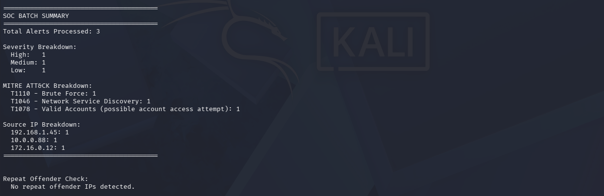
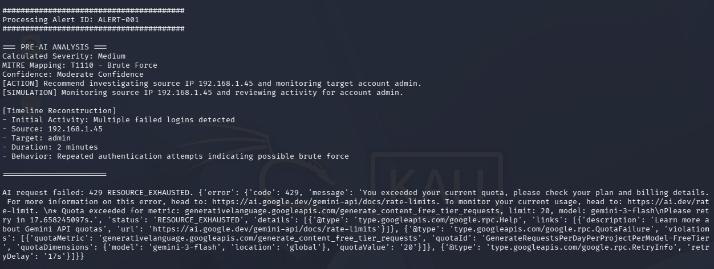
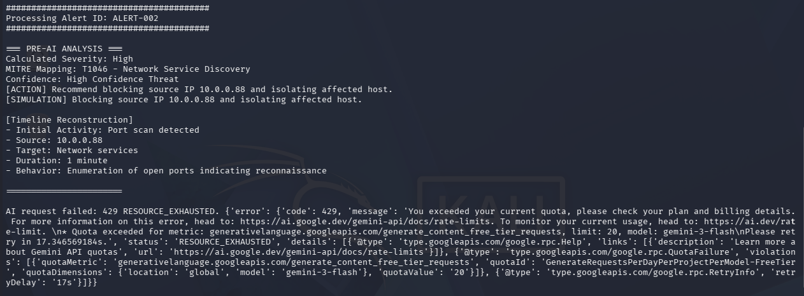
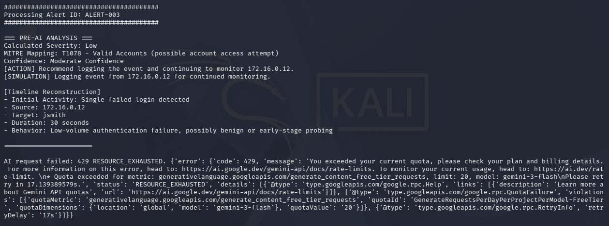
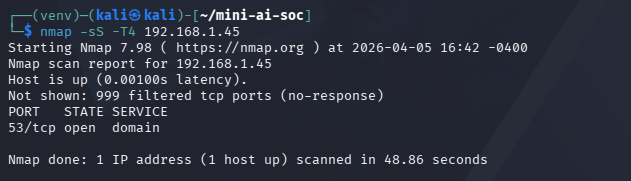
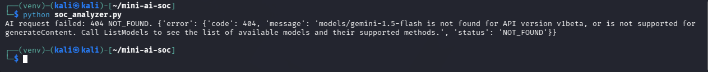

<div align="center">

# 🛡️ AI-Assisted SOC Alert Analyzer

## 🧠 SOC Systems • Detection Engineering • Agentic Investigation


</div>

<div align="center">
  
</div>

<p align="center"><em>SOC batch summary showing alert distribution, MITRE mapping, and correlation across three alert types.</em></p>

---

## 🧠 Purpose

A Python-based security alert triage pipeline that simulates Tier 1 SOC analyst workflows — parsing alerts, applying rule-based severity scoring, mapping activity to MITRE ATT&CK, reconstructing event timelines, and optionally enriching analysis with a Gemini AI call.

This is **Phase 1** of a multi-phase SOC system. The rule-based triage layer runs fully without an API key. AI enrichment is optional and layered on top.

| Stage | Description |
|------|------------|
| Alert Analysis | Parsing and triaging security events |
| Detection Engineering | Mapping behavior to MITRE ATT&CK |
| Investigation | Correlating and enriching alerts |
| Decision Support | Recommending response actions |

---

## 🎯 Objective

The goal of this phase is to demonstrate:

- how alerts are parsed and analyzed
- how severity and confidence are assigned using rule-based thresholds
- how activity maps to MITRE ATT&CK techniques by event type
- how correlation improves context across multiple alerts
- how structured triage supports downstream detection and investigation

---

## 🔍 Phase 1 — SOC Alert Analyzer


| Category | Details |
|---------|--------|
| Focus | Alert parsing and triage |
| Role | SOC analyst simulation |
| Output | Structured alert analysis |

---

## 🧩 How the Triage Logic Works

Each alert passes through a sequence of rule-based functions before any AI is involved:

**Severity** is determined by attempt count:

| Attempts | Severity |
|----------|----------|
| ≥ 20 | High |
| ≥ 10 | Medium |
| < 10 | Low |

**MITRE ATT&CK mapping** uses a keyword lookup on the alert's `event` field:

| Event Type | MITRE Technique |
|------------|----------------|
| Failed login attempts | T1110 — Brute Force |
| Port scan detected | T1046 — Network Service Discovery |
| Single failed login | T1078 — Valid Accounts (possible access attempt) |
| Unknown | Flagged for manual review |

**Response recommendations** are tiered by severity: High triggers an isolation recommendation, Medium triggers monitoring and account review, Low triggers logging with continued observation.

**AI enrichment** (optional) sends the pre-computed triage context to Gemini, asking it to confirm or adjust severity and MITRE mapping, explain why the activity is suspicious, and suggest additional actions. Grounding the prompt with already-computed triage improves response quality and reduces hallucination risk.

---

## 🧠 SOC Triage Workflow

| Stage | Description |
|------|------------|
| 🟦 Raw Alert | Alert ingestion from SIEM |
| 🟨 Triage | Severity and confidence scoring |
| 🧠 MITRE Mapping | Technique identification |
| ⚙️ Response Recommendation | Suggested actions |
| 📊 Correlation | Multi-alert context |
| 🔎 Investigation | Validation (e.g., Nmap) |
| 🤖 AI Enrichment | Optional enhancement |
| 📈 SOC Summary | Aggregated visibility |

---

## ⚡ Quick Start (Run the Project)

### 1. Clone the repository

```bash
git clone https://github.com/shannonasmith/AI-Assisted-SOC-Alert-Analyzer.git
cd AI-Assisted-SOC-Alert-Analyzer
```

### 2. Create and activate a virtual environment

```bash
python3 -m venv venv
source venv/bin/activate
```

### 3. Install dependencies

```bash
pip install -r requirements.txt
```

### 4. Run the analyzer

```bash
# Rule-based triage runs fully without an API key
python soc_analyzer.py alerts.json

# Add AI enrichment with a Gemini key
export GEMINI_API_KEY=your_key_here
python soc_analyzer.py alerts.json
```

---

## 📥 Sample Input

Alerts are passed in as JSON. Each alert includes an event type, source IP, target user, attempt count, and time window — the fields that drive the triage logic.

```json
[
  {
    "id": "ALERT-001",
    "event": "Failed login attempts",
    "source_ip": "192.168.1.45",
    "target_user": "admin",
    "attempts": 15,
    "time_window": "2 minutes"
  },
  {
    "id": "ALERT-002",
    "event": "Port scan detected",
    "source_ip": "10.0.0.88",
    "target_user": "N/A",
    "attempts": 50,
    "time_window": "1 minute"
  },
  {
    "id": "ALERT-003",
    "event": "Single failed login",
    "source_ip": "172.16.0.12",
    "target_user": "jsmith",
    "attempts": 1,
    "time_window": "30 seconds"
  }
]
```

---

## 👀 What This Looks Like in Practice

---

### ⚙️ Step 1 — Alert Processing & Triage

<div align="center">
  
</div>

ALERT-001 (15 failed login attempts against `admin`) scores **Medium** severity, maps to **T1110 — Brute Force**, and triggers a recommendation to investigate the source IP and monitor the target account.

**Analysis performed per alert:**

- severity calculation
- MITRE ATT&CK mapping
- confidence scoring
- response recommendation
- timeline reconstruction

---

### 🧪 Step 2 — Multi-Alert Analysis

<div align="center">
  
</div>

ALERT-002 (50-attempt port scan) scores **High** severity, maps to **T1046 — Network Service Discovery**, and triggers an isolation recommendation. At 50 attempts in 1 minute, this is treated as active reconnaissance.

<div align="center">
  
</div>

ALERT-003 (single failed login) scores **Low** severity and is logged for observation. Low-severity events like this are still surfaced because they can indicate early-stage probing or credential stuffing at low volume.

**Observations across alerts:**

- alerts vary in severity and intent
- correlation across all three reveals two distinct source IPs, one of which (10.0.0.88) appears across multiple high-confidence events
- low-severity events may indicate early-stage activity worth tracking over time

---

### 📈 Step 3 — SOC Correlation & Summary

<div align="center">
  
</div>

After all alerts are processed, the pipeline generates a batch summary across the full alert set.

**Output includes:**

- total alerts processed
- severity breakdown (High / Medium / Low counts)
- MITRE ATT&CK distribution across techniques
- source IP frequency analysis
- repeat offender detection (IPs appearing across multiple alerts)

---

### 🔍 Step 4 — Investigation & Validation

<div align="center">
  
</div>

To validate the port scan alert, an Nmap scan is run against the flagged host to confirm active services.

**Findings:**

- host active
- port 53 open (DNS) — consistent with the reconnaissance behavior flagged by T1046

---

### 🤖 Step 5 — AI Enrichment

<div align="center">
  
</div>

When a Gemini API key is present, each alert's pre-computed triage context is sent to the model with a structured SOC analyst prompt. The model is asked to confirm or adjust the severity and MITRE mapping, explain why the activity is suspicious, and recommend additional response actions.

**Design note:** The AI enrichment step is intentionally layered on top of rule-based triage rather than replacing it. This keeps the pipeline auditable and functional without an API dependency, and gives the model grounded context to work from rather than analyzing a raw alert cold.

---

## 🔍 SOC Analysis Workflow

```text
Alert Generation
    ↓
Rule-Based Triage (severity, MITRE mapping, confidence, timeline)
    ↓
Response Recommendation
    ↓
Multi-Alert Correlation
    ↓
Investigation (Nmap validation)
    ↓
AI Enrichment (Optional — Gemini)
    ↓
SOC Batch Summary
```

---

## 💡 What This Project Demonstrates

- Tier 1 SOC triage workflow simulation
- MITRE ATT&CK technique mapping from structured alert data
- Timeline reconstruction from event metadata
- Prompt engineering for AI-assisted security analysis
- Separation of rule-based and AI-assisted logic in a security pipeline
- Batch correlation and repeat offender detection across multiple alerts

---

## 💼 SOC Relevance

Simulates real Tier 1 SOC work:

- alert prioritization using severity thresholds
- MITRE ATT&CK mapping for technique identification
- initial investigation workflows (Nmap validation)
- analyst decision-making with structured response recommendations

---

## 🧬 Project Progression

This project is part of a **multi-phase SOC system**:

**SOC Alert Analyzer (current)** → [ATT&CK Mapping Engine](https://github.com/shannonasmith/AI-Assisted-SOC-MITRE-ATTACK-Mapping-Engine) → [Agentic SOC Investigation Engine](https://github.com/shannonasmith/Agentic-SOC-Investigation-Engine)

Phase 2 replaces the keyword-based MITRE mapping with a hybrid TF-IDF + embedding scoring engine. Phase 3 adds a stateful agentic investigation loop with IOC enrichment, SOAR playbooks, and automated decision support.

---

## 🚧 Future Work

- integration with detection engine (Phase 2)
- improved correlation logic across longer alert windows
- expanded alert types and enrichment sources
- structured JSON output for downstream pipeline consumption

---

## 🛠️ Tech Stack

| Component | Detail |
|-----------|--------|
| Language | Python 3 |
| AI Enrichment | Google Gemini API (`google-genai`) |
| Alert Format | JSON |
| Mapping Framework | MITRE ATT&CK |
| Triage Logic | Rule-based (no ML dependencies) |
| Validation | Nmap |

---

<div align="center">

## 👤 Shannon Smith

Cybersecurity | Threat Detection • Incident Response • Security Operations

</div>
